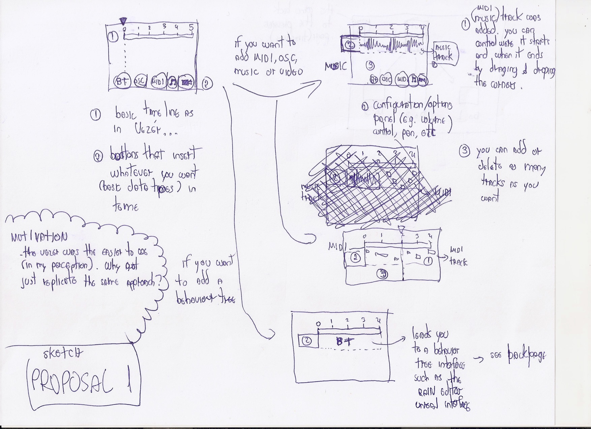
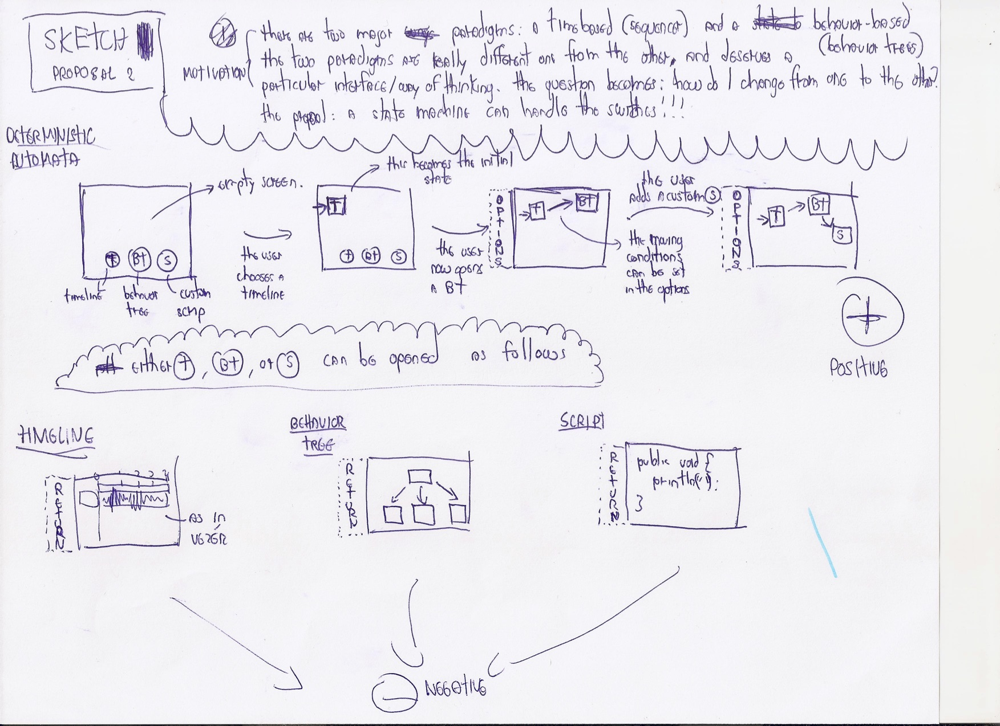
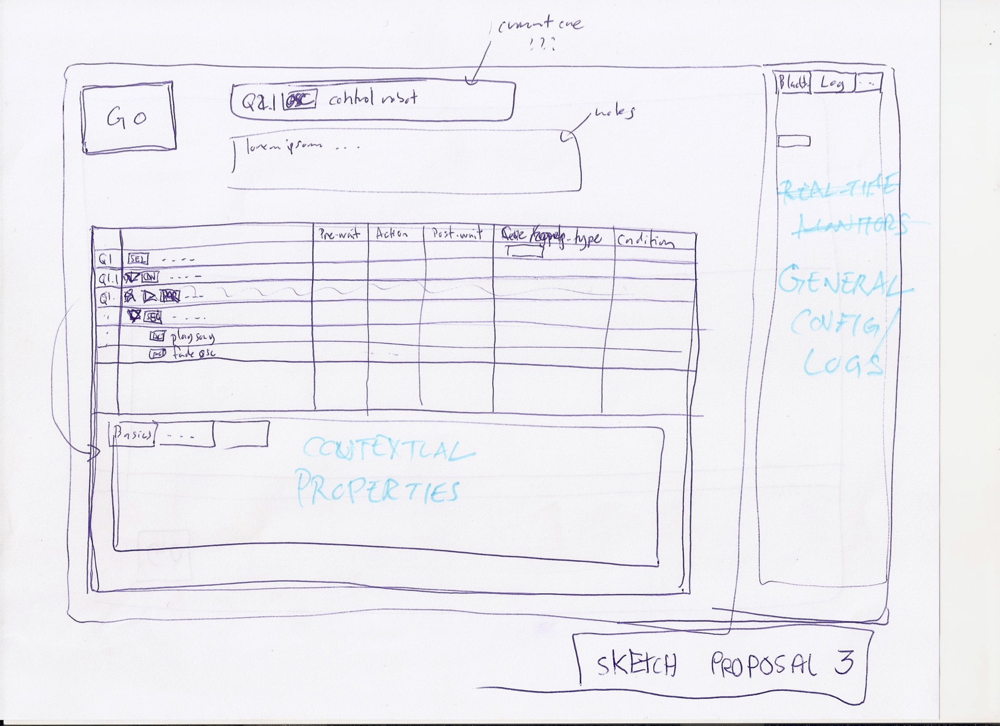
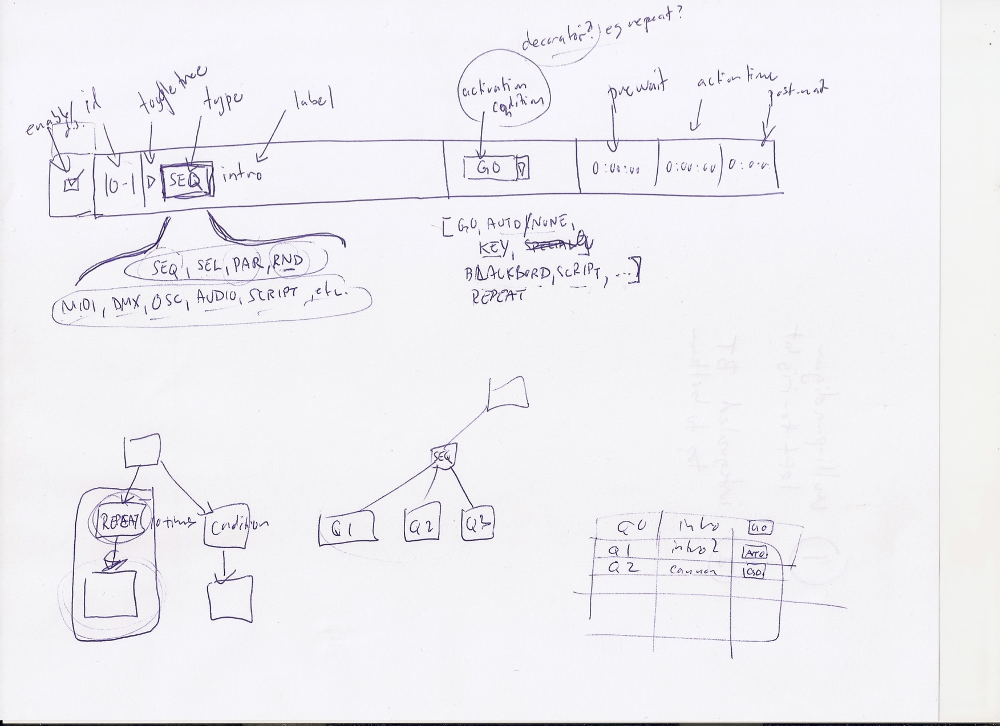

#Analyzing similar tools
- 9 alternative tools analyzed by 2 people;
- 20 minutes/tool for free exploration aiming at the questions below (1h40min total);
- 5 minutes to present each (45 minutes total);
- What aspects should we be looking for (guidelines)?
	* Is it ease to use at the beginning, intuitive?
	* Does it support advanced functionalities for expert users?
	* Is it modular, extendable via plugins?
	* Does it support standard protocols in new media practice (i.e. MIDI, OSC, DMX, Arduino)?
	* Is it open-source & commercial & cross-platform?
	* Is it realtime, for live performances?
- in case we find other similar tools, include them in our analysis;

##Result
https://docs.google.com/spreadsheets/d/1qPLkbONGE4kDj01h0HM6UgcVNlBrMBbCdfRGTayh5aI/edit#gid=0

#Sketching prototypes
Two initial sketches were created: 

##Multi-paradigm left to right

##Integrated behavior tree top to bottom

#What are the next steps
What are we going to do in our next meeting?
##Refine low-fidelity prototype
Ideally applied to one basic use case. Any of these can work:
- Sketching & storyboarding the interaction?
- Paper prototype?
- Functional prototype (using Arduino, Processing, etc)?

##Evaluation & User testing
Use the design guidelines for the evaluation. Interaction should be video recorded:
- Wizard of Oz?
- Informal interview?

Someone at IDMIL (is this the most adequate user for this tool) is going to be our user.

