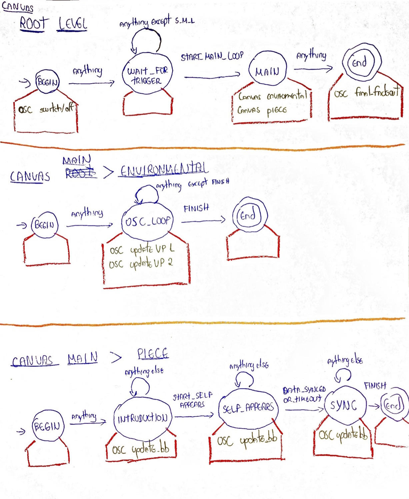

#Scenario 1
Our first scenario implemented by a hierarchical finite state machine. 

##Basic behavior
In this prototype, a state machine (composed by a finite set of states) is represented by a "Canvas". The basic behavior of a Canvas is the same of as in a FSM. 

The only difference relies on the tasks associated to the states. Each "State" (the blue circles in our diagram) has a set of Tasks (the red boxes in our diagram). These tasks run in parallel whenever a state is executed. This allows us to easily implement tasks in parallel (for example, a OSC message could be sent at the same time as an audio is played). 

Tasks can be so far: a) Audio; b) OSC; and c) Other canvas (which allows us to create hierarchy). More (e.g. MIDI, DMX) can be created by extending the abstract class Task.

##Diagram


##Usage
After designing the HFSM, three steps are necessary. First you need to run the HFSM in the setup by using:

```java
root.run();
```

Second, you need to update the HFSM status in the draw:

```java
root.update_status();
```

Finally, you need to tick the HFSM whenever you want to feed the structure with an input. The possible inputs are defined a enumerator called "Input". In the following code, the HFSM receives a new input according to the key pressed:

```java
void keyPressed() {
	Input i;
	
    switch(key) {
    case '1':
      i = Input.START_MAIN_LOOP;
      break;
    case '2':
      i = Input.START_SELF_APPEARS;
      break;
    case '3':
      i = Input.DATA_SYNCED_OR_TIMEOUT;
      break;
    case '4':
      i = Input.FINISH;
      break;
    }
    println("inputing " + i);
    root.tick(i);
  }
```

For our first scenario, the defined Inputs are:

```java
public static enum Input {
    PUSH, //used only inside the Testing_Connection_Class. delete this whenever done with the testing.
    COIN, //used only inside the Testing_Connection_Class. delete this whenever done with the testing.
    START_MAIN_LOOP,
    START_SELF_APPEARS,
    DATA_SYNCED_OR_TIMEOUT,
    FINISH;
}
```

For more details, check the class "Testing_Canvas".

