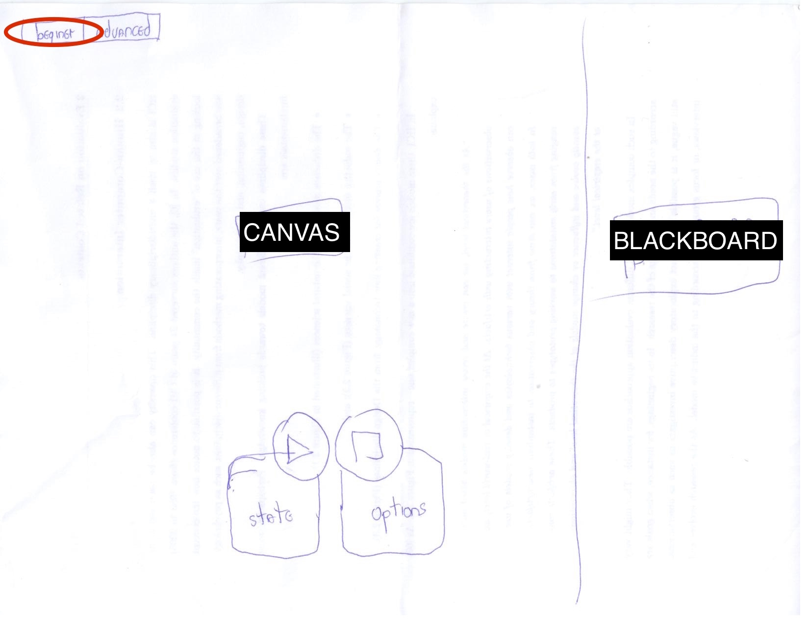
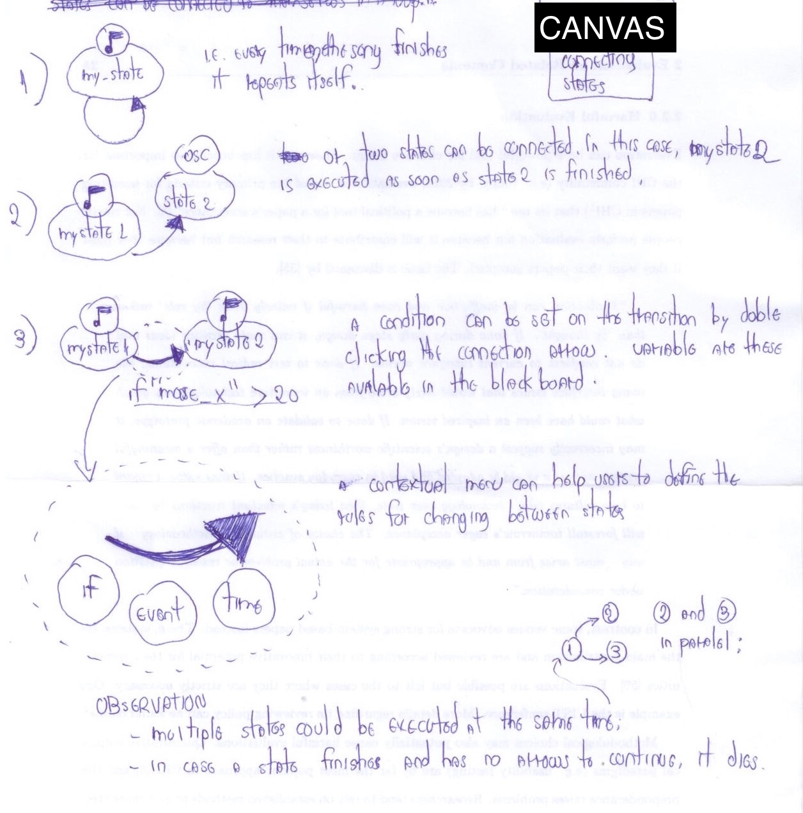

#Interface Prototype 1
The system is generally composed of a blackboard and a control model.

#Blackboard
- Both models uses a blackboard to handle variables. Users can use these variables inside the Behavior Tree nodes or to trigger state changes;
- Could accept OSC messages from other clients (i.e. in case we want to use sensor data input);

#Control model
Defines the rules of how the system is going to behave. Can be separated into two categories: an easy & limited (represented by Finite-State Machines, the FSM) and a complex & powerful (represented by Behavior Trees, the BT). See reference for details regarding where these categories come from.

Control models can be run and stopped by using the big buttons (see images below).

##Easy & limited model: Finite-State Machine
Simple & straightforward, but limited in power and organization.

###How does it look like?

###How to add states?

###How to create connections between states?

###What actions can be associated to the states?
In priority order for the implementation:
- OSC;
- MIDI;
- DMX;
- Audio;
- Video;
- Script;
- Another state;

##Complex & powerful: Behavior Tree
Powerful but more complex to use.

###How does it look like?

###What are our possible nodes?
In priority order for the implementation 1:

**Leaves:**

- OSC; MIDI; DMX; Audio; Video; Script;

**Complex:**

- Parallel;

- Sequence (regular and random?);

- Selector (regular and random?);

- Decorator (Always fail, Always succeed, include, invert, limit, repeat, until success, - until fail).

###How do I add a leaf node?

###How do I add a complex node?

###How to create connections between states?

--

#Practical characteristics
- Allow users to hide/show nodes;
- Use and abuse contextual modes (e.g. Pie menu);
- Continuous feedback to show where you are when executing;
- Straightforward access to the blackboard (check & modification);
- Strong connection with other software used in media practice (MAX, Pd, ableton, processing...);'
- Combine FSM (beginners, easy-to-use) with behavior-trees (powerful, easy to keep track and debug, manageable);
- Web app (multiplatform)?
 
#References: FSM vs. BT	
It seems there is a trade-off between ease of use and expressiveness between FSM and BT. See the following examples:

https://coffeebraingames.wordpress.com/2014/02/23/finite-state-machine-vs-behaviour-tree-a-true-story/

	I needed behaviour trees because I wanted to manage the complexity of the units AI in Warrior Defense which originally used finite state machines (FSM). FSMs are great because they are so simple and intuitive. When they get big, however, they become so complicated. It got to a point where I’m afraid to change the configuration of the FSM because the working AI easily breaks. In other words, it’s brittle. I don’t like that. I still have lots of features to add later on that deal with unit interactions. 
	
	I can’t say that behaviour trees are better, either. They also have a major disadvantage: steep learning curve. You have to think like a compiler when working with BTs. You have to know what its elements mean like Sequence, Selector, Parallel, Decorator, etc. Like every skilled programmers say, “Know your tools. Know where it’s best used.” Behaviour trees has been proven to work on complex behaviours, but I probably can’t give this to a non programmer and let him/her figure it out on his/her own. FSMs are much more easier to understand. They are far more intuitive, too. FSMs are probably the way to go if you only need to model simple behaviours.
	
http://www.gamasutra.com/blogs/JakobRasmussen/20160427/271188/Are_Behavior_Trees_a_Thing_of_the_Past.php

	"[In FSM,] being able to translate from any state to any other state by specifying conditions, makes it very easy to design FSMs for AI behavior. However, it turns out this is also the drawback of the FSM approach. In professional games, FSMs can easily have hundreds of states, and at such sizes they become increasingly difficult to debug. Damian Isla outlined this in detail regarding the AI of Halo 2 at his GDC talk from 2005" 2.
	
	"Behavior Trees in many cases provide a framework for designing more comprehensible and easier-to-read AIs than hierarchical FSMs. Also, the nicely organised tree makes for easier visual debugging in practice. However, the Behavior Tree technique has a number of shortcomings. (...) For very large behavior trees, the costs of evaluating the whole tree can be prohibitive.  The major challenge is that it does not provide a model for improving decision-making. The decision-making is locked to the conditional nodes, without specifying how decisions are made to invoke different subtrees". 

1 https://github.com/libgdx/gdx-ai/wiki/Behavior-Trees
2 http://www.gamasutra.com/view/feature/130663/gdc_2005_proceeding_handling_.php